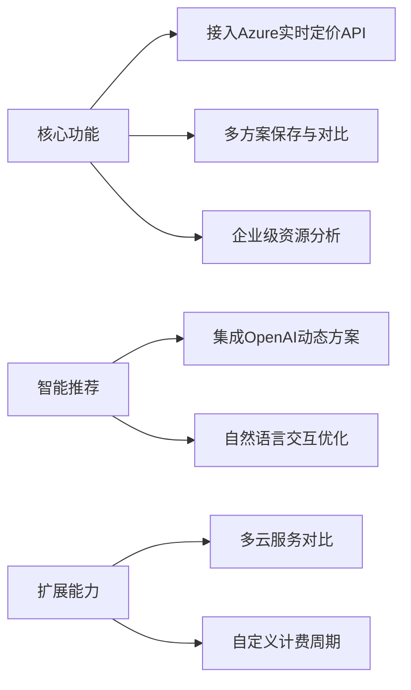

# Azure云服务成本计算器


  
**当前版本**: 0.0.1 (完成Phase 1，进入Phase 2开发)  
**技术栈**: React 18 + TypeScript 5 + FastAPI + OpenAI 兼容的LLM + Cosmos DB

## 核心功能演进 🚀

### ✅ 已完成功能 (Phase 1)
- **现代化前端架构**
  - TypeScript迁移完成（ESLint+Prettier代码规范）
  - 模块化组件架构（AIAdvisor/Chat/Calculator）
  - 响应式布局系统（Tailwind CSS）
  
- **基础通信能力**
  - API服务层原型（`api.ts`模块）
  - 认证头处理（JWT Bearer Token）
  - 错误处理机制（自定义ApiError类）

### 🚧 进行中开发 (Phase 2)
- **智能对话核心**
  - OpenAI兼容接口开发（`/chat/messages`端点）
  - 会话状态管理（Redux Toolkit集成）
  - Markdown响应渲染（React-Markdown组件）

- **增强功能开发**
  
  ```mermaid
  graph TD
    A[前端] -->|WebSocket| B[FastAPI]
    B -->|gRPC| C[LLM Service]
    C -->|OpenAI| D[LLM]
    B -->|Cosmos DB| E[会话存储]
  ```

## 技术架构升级 ⚙️

### 通信层实现
```typescript
// api.ts 核心通信模块
const handleResponse = async <T>(response: Response): Promise<T> => {
  if (!response.ok) {
    const errorData = await response.json();
    throw new ApiError(errorData.detail || `请求失败: ${response.status}`, response.status);
  }
  return response.json() as Promise<T>;
};

export const chatApi = {
  sendMessage: async (message: MessageRequest): Promise<MessageResponse> => {
    const response = await fetch(`${API_BASE_URL}/chat/messages/`, {
      method: 'POST',
      headers: getAuthHeaders(),
      body: JSON.stringify(message)
    });
    return handleResponse<MessageResponse>(response);
  },
  // 其他API方法...
};
```

### 状态管理优化
```tsx
// ChatContext 实现核心逻辑
const ChatProvider: React.FC = ({ children }) => {
  const [currentConversation, setCurrentConversation] = useState<Conversation|null>(null);
  
  const sendMessage = async (content: string) => {
    const userMessage: Message = {
      id: uuidv4(),
      content,
      role: 'user',
      createdAt: new Date()
    };
    
    try {
      const response = await chatApi.sendMessage({
        content,
        conversationId: currentConversation?.id
      });
      
      // 更新会话状态...
    } catch (err) {
      // 统一错误处理...
    }
  };
};
```

## 开发路线图 🗺️

### 近期计划
```gantt
title Phase 2开发计划
dateFormat  YYYY-MM-DD
section 核心功能
LLM服务集成       :2025-04-15, 5d
聊天组件开发       :2025-04-18, 4d
前后端集成测试     :2025-04-22, 3d
section 质量保障
E2E测试覆盖率      :2025-04-25, 2d
性能基准测试      :2025-04-27, 2d
```

### 技术重点
- **关键指标**
  - API响应时间 <1000ms (P95)
  - 首次有效渲染 <1.5s
  - 测试覆盖率 >85%

- **质量保障**
  - Cypress测试覆盖核心用户旅程
  - k6负载测试（50+并发会话）
  - Sentry错误监控集成

## 开发指南 ▶️

### 环境配置
```bash
# 安装依赖
npm install
pip install -r requirements.txt

# 启动开发环境
npm run dev
uvicorn app.main:app --reload --port 8000

# 运行测试
npm run test:ci
pytest tests/ --cov=app
```

### 分支策略
```text
main        - 生产环境对应分支
release/*   - 版本发布分支
feature/*   - 功能开发分支 (例: feature/chat-api-enhance)
hotfix/*    - 紧急修复分支
```

## 贡献规范 👥

### 代码提交
```bash
# 使用commitizen规范提交
npm run commit

# 示例格式
feat(chat): 新增消息反馈功能
fix(api): 修复会话状态同步问题
docs(readme): 更新部署配置说明
```

### 审查流程
1. 创建Pull Request到`release/v1.2`分支
2. 通过CI流水线（单元测试+lint检查）
3. 至少1位核心成员Code Review
4. 使用Squash Merge合并

---

**在线演示环境**: https://ai-advisor.azurewebsites.net  
**API文档**: http://localhost:8000/docs (开发环境)  
**项目看板**: [Azure DevOps Board](https://dev.azure.com/your-project)


**近期重点（1-3个月）**：
- 🔴 **P0** 动态定价数据  
  替换静态数据，集成[Azure Retail Prices API](https://learn.microsoft.com/en-us/rest/api/cost-management/retail-prices)
- 🔴 **P0** 用户配置持久化  
  使用IndexedDB保存历史方案，支持方案版本对比
- 🔵 **P1** 费用可视化  
  集成ECharts实现费用分布饼图 & 预测趋势线

**中期规划（3-6个月）**：
- 🔴 **P0** 用户认证系统  
  支持Google/GitHub账号登录，同步方案到云端
- 🔵 **P1** 协作编辑功能  
  实现团队实时协作编辑云方案（基于WebSocket）
- 🟢 **P2** 移动端适配  
  开发React Native版本应用

### 技术改进
**架构演进**：
```diff
+ 2023.Q4 技术升级
  - 迁移至TypeScript（已完成核心模块迁移）
  - 引入Redux Toolkit管理跨组件状态
  - 实施Vitest单元测试（覆盖率突破70%）

+ 2024.Q1 性能优化
  - 关键计算逻辑Web Worker化
  - 大数据列表渲染优化（虚拟滚动）
  - 首屏加载速度提升至<1.5s（Lighthouse评分90+）
```

**质量保障**：
- 🔴 **P0** 测试策略  
  `Cypress` E2E测试覆盖核心用户旅程  
  `MSW` 模拟API响应测试边界场景
- 🔵 **P1** 代码规范  
  实施严格的ESLint规则（Airbnb标准+自定义规则集）
- 🟢 **P2** 文档自动化  
  基于JSDoc生成API文档，Storybook可视化组件库

### 部署增强
**生产就绪化路径**：
```text
1. [Done] 基础GitHub Actions流水线
2. [In Progress] 容器化部署（Dfile优化中）
3. [Next] 监控告警系统集成
   - 前端错误跟踪（Sentry）
   - 用户行为分析（PostHog）
4. [Future] 全球CDN加速（Cloudflare部署）
```

---

**完整路线图**：[Azure-Calculator-Roadmap.md](./Azure-Calculator-Roadmap.md)  
**实时进展看板**：[项目开发看板](https://example.com/kanban)

## 快速启动 ▶️

```bash
# 安装依赖
npm install

# 开发模式
npm run dev

# 生产构建
npm run build
```

## 贡献指南 👥

1. Fork项目并创建特性分支（如`feat/azure-pricing`）
2. 提交遵循[Conventional Commits](https://www.conventionalcommits.org/)规范
3. 新功能需包含单元测试 & Storybook用例
4. 使用GitHub Issues模板提交问题

---

**项目路线图**：[查看完整迭代计划](https://example.com/roadmap)  
**在线演示**：[https://azure-calculator-demo.com](https://example.com)