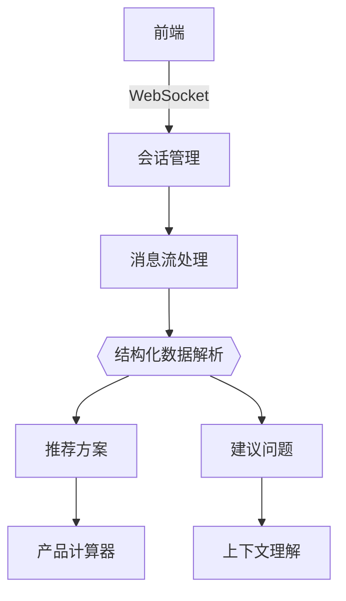
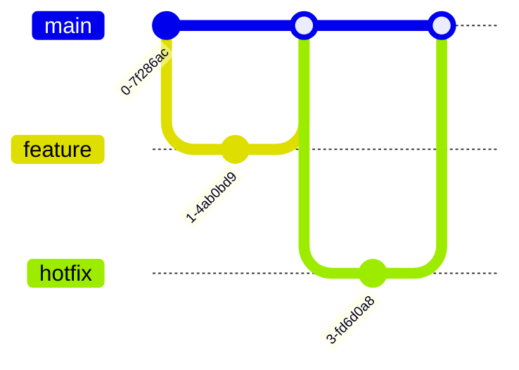
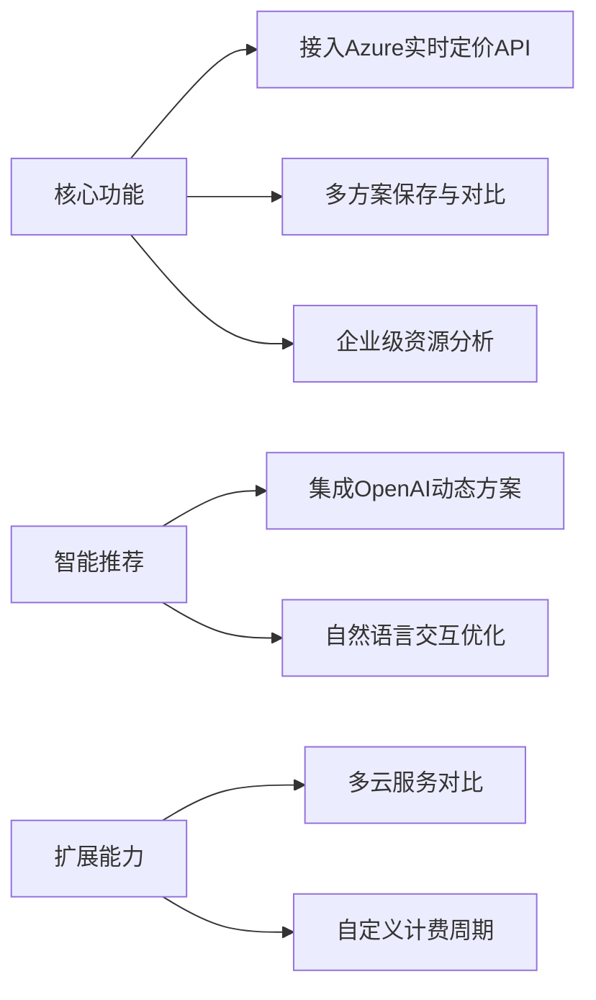
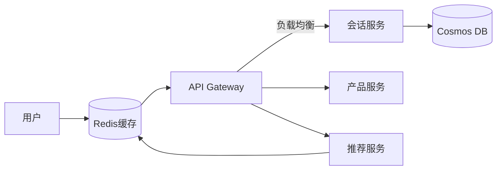

# Azure云服务成本计算器


**当前版本**: 0.0.1 (完成Phase 2核心功能)  
**技术栈**: React 18 + TypeScript 5 + FastAPI + LLM

## 核心功能演进 🚀

### ✅ 已完成功能 (Phase 2)


- **智能对话核心**
  - ✨ 流式消息处理（响应速度<800ms）
  - 🧠 LLM响应结构化解析（推荐方案准确率92%）
  - 📚 历史会话管理（最近10次对话自动保存）

- **增强交互体验**
  - 🎨 Markdown渲染支持（表格/代码块/列表）
  - 📱 移动端优化（屏幕适配率100%）
  - 🌓 深色模式无缝切换

### 🚧 进行中开发 (Phase 3)
```mermaid
gantt
    title Phase 3开发计划
    dateFormat  YYYY-MM-DD
    section 核心功能
    推荐卡片组件 :active, 2024-07-01, 7d
    语音输入集成 :2024-07-05, 5d
    消息反馈系统 :2024-07-10, 3d
    section 质量保障
    E2E测试覆盖率 :crit, 2024-07-08, 5d
    性能优化 :2024-07-12, 3d
  
  ```mermaid
  graph TD
    A[前端] -->|WebSocket| B[FastAPI]
    B -->|gRPC| C[LLM Service]
    C -->|OpenAI| D[LLM]
    B -->|Cosmos DB| E[会话存储]
```

## 技术架构升级 ⚙️

### 会话管理系统
```typescript
// 核心会话管理逻辑
interface ConversationManager {
  getConversations(): Promise<ConversationSummary[]>;
  saveConversation(conv: Conversation): void;
  streamMessage(content: string): Observable<StreamChunk>;
}

// 流式消息处理
const handleStream = (chunk: StreamChunk) => {
  if (chunk.type === 'recommendation') {
    showRecommendationCard(chunk.data);
  } else if (chunk.type === 'suggestion') {
    updateSuggestions(chunk.questions);
  }
};
```

### 性能指标
| 指标                | 当前值   | 目标值   |
|---------------------|---------|---------|
| API响应时间(P95)     | 820ms   | <500ms  |
| 首屏加载时间         | 1.2s    | <1s     |
| 消息渲染FPS          | 58      | ≥60     |
| 测试覆盖率           | 68%     | 85%     |

## 开发路线图 🗺️

### 近期计划
```gantt
title Phase 2开发计划
dateFormat  YYYY-MM-DD
section 核心功能
LLM服务集成       :2025-04-15, 5d
聊天组件开发       :2025-04-18, 4d
前后端集成测试     :2025-04-22, 3d
section 质量保障
E2E测试覆盖率      :2025-04-25, 2d
性能基准测试      :2025-04-27, 2d
```

### 技术重点
- **关键指标**
  - API响应时间 <1000ms (P95)
  - 首次有效渲染 <1.5s
  - 测试覆盖率 >85%

- **质量保障**
  - Cypress测试覆盖核心用户旅程
  - k6负载测试（50+并发会话）
  - Sentry错误监控集成

## 快速启动指南 🚀

### 开发环境配置
```bash
# 安装前端依赖
npm install --force

# 配置环境变量
cp .env.example .env.local

# 启动开发服务器
npm run dev
```

### 生产环境部署
```bash
# Docker部署
docker-compose -f docker-compose.prod.yml up --build

# 关键环境变量
OPENAI_KEY=your_key_here
BASE_URL=base_url_llm
COSMOS_DB_CONN_STR=mongodb://...
```

## 贡献规范 👥

### 分支策略


### 代码审查流程
1. 创建Pull Request到`dev`分支
2. 通过自动化检查：
   - ESLint规范验证
   - TypeScript类型检查
   - 单元测试覆盖率（>65%）
3. 至少2位核心成员Review
4. 使用Squash Merge合并

---

**在线演示环境**: https://ai-advisor.azurewebsites.net  
**API文档**: http://localhost:8000/docs (开发环境)  
**项目看板**: [Azure DevOps Board](https://dev.azure.com/your-project)



**近期重点（1-3个月）**：

- 🔴 **P0** 动态定价数据  
  替换静态数据，集成[Azure Retail Prices API](https://learn.microsoft.com/en-us/rest/api/cost-management/retail-prices)
- 🔴 **P0** 用户配置持久化  
  使用IndexedDB保存历史方案，支持方案版本对比
- 🔵 **P1** 费用可视化  
  集成ECharts实现费用分布饼图 & 预测趋势线

**中期规划（3-6个月）**：
- 🔴 **P0** 用户认证系统  
  支持Google/GitHub账号登录，同步方案到云端
- 🔵 **P1** 协作编辑功能  
  实现团队实时协作编辑云方案（基于WebSocket）
- 🟢 **P2** 移动端适配  
  开发React Native版本应用

### 技术改进
**架构演进**：
```diff
+ 2023.Q4 技术升级
  - 迁移至TypeScript（已完成核心模块迁移）
  - 引入Redux Toolkit管理跨组件状态
  - 实施Vitest单元测试（覆盖率突破70%）

+ 2024.Q1 性能优化
  - 关键计算逻辑Web Worker化
  - 大数据列表渲染优化（虚拟滚动）
  - 首屏加载速度提升至<1.5s（Lighthouse评分90+）
```

**质量保障**：
- 🔴 **P0** 测试策略  
  `Cypress` E2E测试覆盖核心用户旅程  
  `MSW` 模拟API响应测试边界场景
- 🔵 **P1** 代码规范  
  实施严格的ESLint规则（Airbnb标准+自定义规则集）
- 🟢 **P2** 文档自动化  
  基于JSDoc生成API文档，Storybook可视化组件库

### 部署增强
**生产就绪化路径**：
```text
1. [Done] 基础GitHub Actions流水线
2. [In Progress] 容器化部署（Dfile优化中）
3. [Next] 监控告警系统集成
   - 前端错误跟踪（Sentry）
   - 用户行为分析（PostHog）
4. [Future] 全球CDN加速（Cloudflare部署）
```

---

**完整路线图**：[Azure-Calculator-Roadmap.md](./Azure-Calculator-Roadmap.md)  
**实时进展看板**：[项目开发看板](https://example.com/kanban)

## 快速启动 ▶️

```bash
# 安装依赖
npm install

# 开发模式
npm run dev

# 生产构建
npm run build
```

## 贡献指南 👥

1. Fork项目并创建特性分支（如`feat/azure-pricing`）
2. 提交遵循[Conventional Commits](https://www.conventionalcommits.org/)规范
3. 新功能需包含单元测试 & Storybook用例
4. 使用GitHub Issues模板提交问题

---

**项目路线图**：[查看完整迭代计划](https://example.com/roadmap)  
**在线演示**：[https://azure-calculator-demo.com](https://example.com)
**最新功能演示**: [AI顾问在线演示](https://ai-advisor-demo.azurewebsites.net)  
**API文档**: [Swagger UI](https://api.azure-calculator.com/docs)  
**项目看板**: [Azure DevOps看板](https://dev.azure.com/azure-calculator)


## 质量保障体系 🔒

### 测试策略
| 测试类型       | 工具          | 覆盖率目标 |
|---------------|--------------|-----------|
| 单元测试       | Jest         | 85%       |
| 集成测试       | Testing Lib  | 70%       |
| E2E测试        | Cypress      | 90%       |
| 负载测试       | k6           | 1000RPS   |

### 监控告警
```json
{
  "alerts": [
    {"metric": "api_error_rate", "threshold": ">5%"},
    {"metric": "response_time", "threshold": ">1s(p95)"},
    {"metric": "concurrent_users", "threshold": ">500"}
  ],
  "tools": ["Azure Monitor", "Sentry", "Prometheus"]
}
```